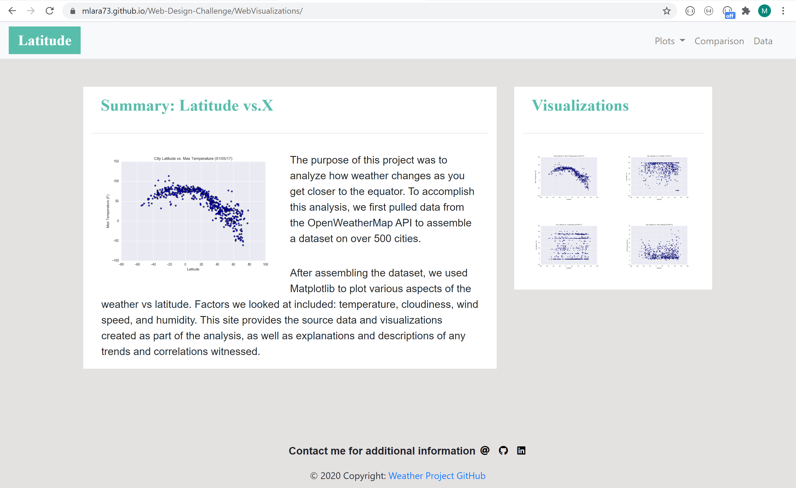
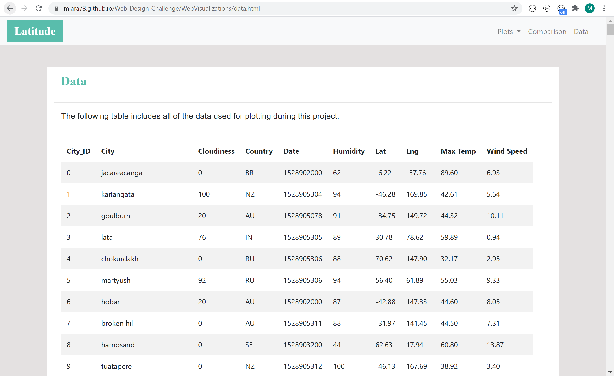

# Weather Visualizations

######  In this mini project a weather analysis visualization dashboard website was created.
######	Seven pages were deployed in GitHub and designed using "HTML" as source code, as welll as"Bootstrap" and "CSS" for styling:

#### Home page:

#### Data Source Page:

